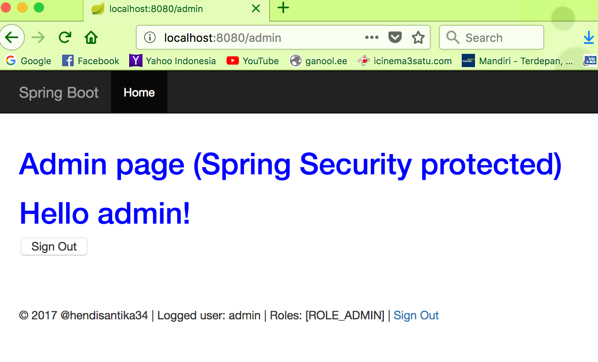

# Spring Boot Spring Security Thymeleaf

#### Spring Security

#### Extends WebSecurityConfigurerAdapter, and defined the security rules in the configure method.

**For user “admin” :**

    * Able to access /admin page
    * Unable to access /user page, redirect to 403 access denied page.

**For user “user” :**

    * able to access /user page
    * unable to access /admin page, redirect to 403 access denied page.

#### To Run this :
`mvn spring-boot:run`

Access `http://localhost:8080`

Login Home

Login Admin Home

Login as Admin Home

Logout Admin Home

Login User Home

Login as User Home

Logout Admin Home

Login Admin Home

Login as Admin Home

Access Deniud Home

